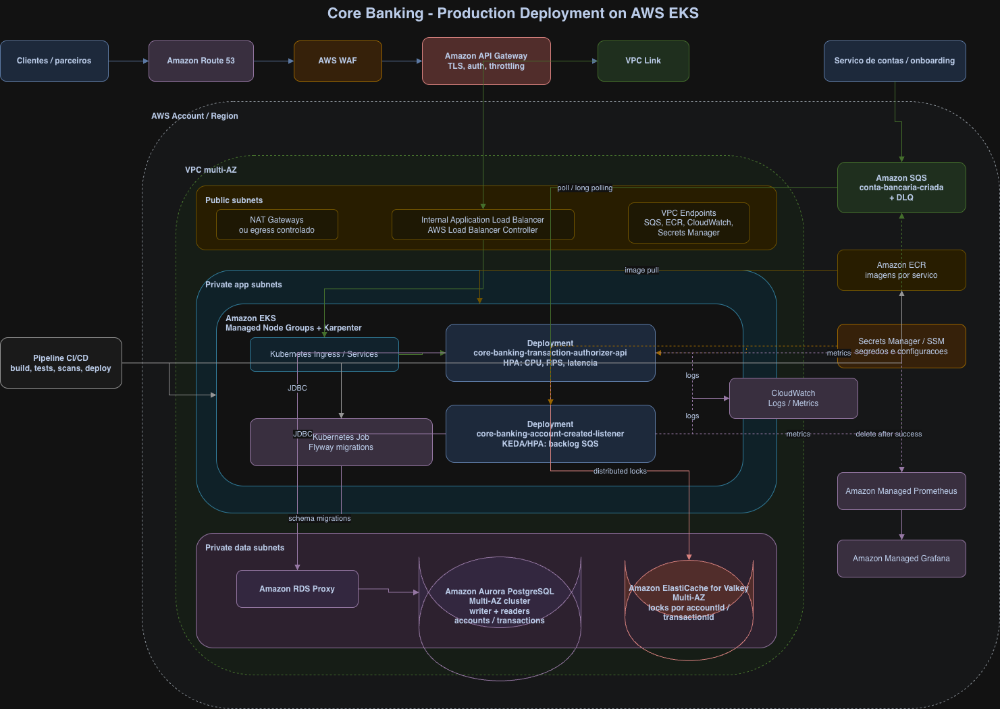

# Core Banking — Transaction Authorizer

Solução do desafio técnico de **autorização de transações financeiras** para core
banking, em **Java 21 + Spring Boot 3**, organizada como um **monorepo Maven
multi-módulo** com **dois serviços** e um kernel compartilhado.

## Serviços

| Módulo | Tipo | Responsabilidade | Porta |
|---|---|---|---|
| `core-banking-transaction-authorizer-api` | síncrono | `POST /transactions/{transactionId}` — autorização CREDIT/DEBIT. **Owner do schema (Flyway).** | 8080 |
| `core-banking-account-created-listener` | assíncrono | Consome a fila SQS `conta-bancaria-criada` e importa contas. **Flyway desabilitado.** | 8081 |
| `core-banking-commons-domain` | biblioteca | Linguagem de domínio compartilhada: enums e convenções de dinheiro. Sem Spring/JPA. | — |

Ambos compartilham **um único PostgreSQL** (mesmo bounded context). A decisão
está documentada em [docs/adr/0001-two-services-architecture.md](docs/adr/0001-two-services-architecture.md).

Documentação adicional: [arquitetura](docs/architecture.md) ·
[deploy em cloud](docs/cloud-deployment.md) · [pipeline CI/CD](docs/pipeline.md) ·
[backlog production readiness](docs/production-readiness-backlog.md).

## Diagrama de deploy em cloud



Arquivo editável para apresentação: [docs/cloud-deployment.drawio](docs/cloud-deployment.drawio).

## Manifests Kubernetes

Os manifests para EKS ficam em `k8s/`, separados por ambiente:

- `k8s/dev.yaml`
- `k8s/hml.yaml`
- `k8s/prod.yaml`

Antes de aplicar, substitua os placeholders de conta AWS, imagens ECR
(preferencialmente por tag/digest imutável gerado no pipeline), endpoints de RDS
Proxy/Aurora, Valkey, URL da fila SQS e segredos de banco.

```bash
kubectl apply -f k8s/dev.yaml
kubectl apply -f k8s/hml.yaml
kubectl apply -f k8s/prod.yaml
```

## Estrutura

```
core-banking-transaction-authorizer/
├── pom.xml                       # parent/aggregator
├── docker-compose.yml
├── k8s/                           # manifests dev/hml/prod para EKS
├── requests/                     # coleção HTTP para revisão manual
├── core-banking-commons-domain/
├── core-banking-transaction-authorizer-api/
├── core-banking-account-created-listener/
└── docs/  (architecture, cloud-deployment, pipeline, adr/)
```

---

## Pré-requisitos

- **JDK 21**, **Maven 3.9+**
- **Docker** + **Docker Compose v2**
- (Opcional) **AWS CLI** para inspecionar a fila SQS

## Build e testes

```bash
./scripts/build-all.sh
```

O script executa `mvn clean verify`, compilando todos os módulos, rodando os
testes e gerando os artefatos.

> Os testes de integração usam **PostgreSQL real via Testcontainers** (nunca H2).
> Sem Docker/Testcontainers funcional, eles são ignorados de forma segura. Para
> rodar apenas os unitários:
> `mvn clean test -Dtest='!*IntegrationTest' -Dsurefire.failIfNoSpecifiedTests=false`.

### Estratégia de testes

A solução possui testes unitários, testes de controller, testes de integração com PostgreSQL via Testcontainers e testes de concorrência para validar consistência de saldo em cenários simultâneos.

Os principais cenários cobertos são autorização de crédito, autorização de débito, saldo insuficiente, idempotência por transactionId, conflito de idempotência, importação de contas via SQS, mensagens duplicadas e concorrência sobre a mesma conta.

O uso de PostgreSQL real nos testes de integração evita diferenças de comportamento que poderiam ocorrer com bancos em memória.

Os testes de concorrência usam `ExecutorService` + `CountDownLatch` (disparo simultâneo) e `assertTimeout`, sem `Thread.sleep` nem estado compartilhado entre testes. Incluem: 20 débitos simultâneos (10 `SUCCEEDED` / 10 `FAILED`, saldo final `0.00`, nunca negativo), 50 créditos simultâneos (saldo `50.00`) e 10 chamadas simultâneas com o mesmo `transactionId` (saldo aplicado uma única vez, `10.00`).

O fluxo assíncrono do listener é coberto por testes unitários fortes do consumer (mockando `SqsClient`) e por um teste de integração com PostgreSQL que valida a persistência da conta. O fluxo ponta-a-ponta com SQS pode ser validado localmente via `docker compose up --build`.

---

## Subir tudo com Docker Compose

O `docker-compose.yml` sobe: `postgres`, `localstack` (SQS), `message-generator`
(cria a fila e publica **100.000** contas), `core-banking-transaction-authorizer-api` e
`core-banking-account-created-listener`.

```bash
./scripts/start-local.sh
```

Antes do `up`, o script verifica as imagens Docker necessárias e baixa apenas as
que ainda não existem localmente, com retry sequencial. Para pular essa checagem:
`./scripts/start-local.sh --skip-image-check`.

Aguarde `message-generator exited with code 0` (fila populada). A API roda as
migrations no startup; o listener sobe depois da API (via `depends_on` healthy) e
começa a drenar a fila.

Os dois serviços rodam dentro dos containers com o profile `local`, e os
hostnames (`postgres`, `localstack`) são injetados por variáveis de ambiente
padrão do Spring (`SPRING_DATASOURCE_URL`, `APP_AWS_SQS_*`).

Verificar a **API** (porta 8080):

```bash
curl http://localhost:8080/actuator/health
```

Verificar o **Listener** (porta 8081):

```bash
curl http://localhost:8081/actuator/health
```

Verificar a **fila SQS**:

```bash
export AWS_DEFAULT_REGION=sa-east-1
export AWS_ACCESS_KEY_ID=test
export AWS_SECRET_ACCESS_KEY=test

aws --endpoint-url=http://localhost:4566 \
  sqs receive-message \
  --queue-url http://localhost:4566/000000000000/conta-bancaria-criada \
  --max-number-of-messages 10
```

Swagger (API): http://localhost:8080/swagger-ui.html

Coleção de requisições: [requests/transaction-authorizer.http](requests/transaction-authorizer.http).

Para subir em background:

```bash
./scripts/start-local.sh --detached
```

> Derrubar e limpar o volume: `docker compose down -v` ou subir limpando tudo com
> `./scripts/start-local.sh --clean`.

---

## Rodar os serviços localmente (sem Docker para a app)

Suba só a infraestrutura e rode cada serviço com o profile `local`:

```bash
./scripts/start-local.sh --infra-only --detached

# Terminal 1 — API (porta 8080, roda Flyway)
mvn -pl core-banking-transaction-authorizer-api -am spring-boot:run \
  -Dspring-boot.run.profiles=local

# Terminal 2 — Listener (porta 8081, consome SQS)
mvn -pl core-banking-account-created-listener -am spring-boot:run \
  -Dspring-boot.run.profiles=local
```

> Inicie a **API antes** do listener: a API cria o schema (Flyway) que o listener
> apenas valida.

### Verificar LocalStack e a fila SQS

```bash
curl -s http://localhost:4566/_localstack/health | jq .

export AWS_DEFAULT_REGION=sa-east-1
export AWS_ACCESS_KEY_ID=test
export AWS_SECRET_ACCESS_KEY=test

aws --endpoint-url=http://localhost:4566 --region sa-east-1 sqs receive-message \
  --queue-url http://localhost:4566/000000000000/conta-bancaria-criada \
  --max-number-of-messages 10
```

---

## API de autorização

`POST /transactions/{transactionId}`

**Request**

```json
{
  "accountId": "5b19c8b6-0cc4-4c72-a989-0c2ee15fa975",
  "type": "CREDIT",
  "amount": { "value": 97.07, "currency": "BRL" }
}
```

**Response** — `200 OK`

```json
{
  "transaction": {
    "id": "8e8ae808-b154-48b5-9f3e-553935cc4543",
    "type": "CREDIT",
    "amount": { "value": 97.07, "currency": "BRL" },
    "status": "SUCCEEDED",
    "timestamp": "2025-07-08T15:57:55-03:00"
  },
  "account": {
    "id": "5b19c8b6-0cc4-4c72-a989-0c2ee15fa975",
    "balance": { "amount": 183.12, "currency": "BRL" }
  }
}
```

| Situação | HTTP |
|---|---|
| `SUCCEEDED` ou `FAILED` por regra de negócio (saldo insuficiente / conta desabilitada) | `200 OK` |
| Validação / `transactionId` inválido / moeda ≠ BRL | `400 Bad Request` |
| Conta não encontrada | `404 Not Found` |
| Conflito de idempotência | `409 Conflict` |
| Erro inesperado | `500 Internal Server Error` |

### Regras de negócio

- Conta inexistente → `404`; conta não-`ENABLED` → `FAILED (ACCOUNT_DISABLED)`, saldo intacto.
- `CREDIT` soma; `DEBIT` subtrai. `DEBIT` que resultaria em saldo negativo → `FAILED (INSUFFICIENT_FUNDS)`, saldo intacto.
- Saldo em `BigDecimal` / `NUMERIC(19,2)`; moeda suportada: `BRL`.

---

## Consistência transacional e idempotência

A autorização roda numa transação ACID no PostgreSQL. A conta é lida com **lock
pessimista** (`PESSIMISTIC_WRITE`) antes de alterar o saldo, serializando
operações concorrentes na mesma conta. O `transactionId` é a **chave de
idempotência**: replay com mesmo payload retorna o resultado anterior (sem
reaplicar saldo); com payload diferente retorna `409 CONFLICT`.

### Módulo de domínio compartilhado

O módulo `core-banking-commons-domain` concentra apenas vocabulário de domínio estável
e livre de framework: status de conta/transação, tipos de transação, motivos de
falha e convenções de dinheiro. Ele não contém entidades JPA, DTOs REST/SQS,
repositories, configurações Spring ou regras de caso de uso, evitando que vire
um `commons` genérico e acople os serviços por implementação.

### Redis-compatible/Valkey: distributed locks

A aplicação usa protocolo/cliente Redis-compatible como camada auxiliar para
coordenação distribuída entre múltiplas instâncias. Localmente isso roda com
Redis no Docker Compose; em produção, a proposta cloud usa **Amazon ElastiCache
for Valkey**.

A API utiliza locks temporários por `transactionId` e por `accountId` para reduzir processamento simultâneo duplicado e contenção no banco. Quando uma requisição encontra o lock ocupado, ela aguarda e tenta novamente internamente até `app.redis-lock.wait-timeout`, usando backoff exponencial com full jitter a partir de `app.redis-lock.retry-delay` e limitado por `app.redis-lock.max-retry-delay`.

Como Redis/Valkey é camada auxiliar, a política padrão para indisponibilidade é `fail-open`: o circuit breaker abre após falhas consecutivas, bypassa temporariamente o lock distribuído e deixa o PostgreSQL seguir como garantia final de consistência. Para ambientes que prefiram proteger latência e recusar autorização enquanto Redis/Valkey estiver indisponível, `app.redis-lock.circuit-breaker.fallback=FAIL_CLOSED` retorna `503`.

A consistência final do saldo continua sendo responsabilidade do PostgreSQL, por meio de transação ACID, chave única em `transactions.id` e lock pessimista na conta. Redis/Valkey não armazena saldo e não é fonte da verdade.

Se o lock não for adquirido dentro do timeout configurado, a requisição é recusada sem persistir a transação. O cliente pode repetir o mesmo `transactionId`; a idempotência garante que uma transação já processada não seja aplicada duas vezes.

Os locks são adquiridos sempre na ordem `transactionId` → `accountId` (nunca invertida, para evitar deadlock lógico), com unlock seguro por *owner* (Lua script). No `core-banking-account-created-listener` o lock distribuído não é usado: a idempotência da importação já é garantida pela primary key `accounts.id` (a coordenação distribuída é mais crítica na API de autorização). Detalhes e trade-offs em [docs/adr/0007-redis-distributed-locks.md](docs/adr/0007-redis-distributed-locks.md).

## Importação de contas via SQS

O listener consome `conta-bancaria-criada` com long polling. Contas são
importadas com saldo zero e moeda BRL; o processamento é **idempotente** (não
duplica) e a mensagem só é **deletada após sucesso** (entrega at-least-once).

## Persistência e migrations

O PostgreSQL é o banco relacional ACID compartilhado. As **migrations Flyway
ficam apenas na `core-banking-transaction-authorizer-api`** (owner do schema); o listener
usa `spring.flyway.enabled=false` e apenas valida o mapeamento. Em produção, as
migrations seriam executadas por um **job/step de pipeline antes do deploy** dos
serviços (ver [docs/pipeline.md](docs/pipeline.md)).

## Observabilidade

Ambos expõem Actuator (`/actuator/health`, `/actuator/prometheus`) e métricas
Micrometer. A API propaga/retorna `X-Correlation-Id` e inclui `correlationId` e
`transactionId` no MDC dos logs. A API publica métricas de negócio:
`transactions.authorizations.total`, `transactions.idempotency.replays.total`,
`transactions.idempotency.conflicts.total`, `transactions.accounts.not_found.total`,
`transactions.locks.acquired.total`, `transactions.locks.timeouts.total` e
`transactions.locks.wait.duration`, além dos sinais de resiliência
`transactions.locks.infrastructure_failures.total`,
`transactions.locks.circuit.opened.total` e
`transactions.locks.bypassed.total`. O listener publica
`accounts.imported.total`, `accounts.duplicates.total`,
`sqs.account-created.messages.processed.total`,
`sqs.account-created.messages.failed.total`.

## Resiliência: implementado e backlog

Implementado neste case:

- Idempotência por `transactionId`, com replay seguro e conflito para payload divergente.
- Lock pessimista no PostgreSQL como garantia final de consistência.
- Lock distribuído Redis-compatible/Valkey por `transactionId` e `accountId`, com espera interna configurável, backoff exponencial e full jitter.
- Circuit breaker para Redis-compatible/Valkey com `fail-open` padrão e `fail-closed` configurável.
- Processamento SQS at-least-once: mensagem só é deletada após sucesso e importação é idempotente por `accountId`.
- Health checks, shutdown graceful, Actuator/Prometheus, métricas de negócio da API, correlation ID/MDC, Dockerfiles e `docker-compose` completo para execução local.

Assumidamente deixado como evolução por risco/tempo:

- DLQ local no LocalStack; em cloud a proposta já prevê SQS com DLQ e redrive policy.
- Tracing distribuído com OpenTelemetry.
- Teste de carga automatizado (`k6` ou Gatling) e guia formal de capacidade.

Esses itens estão priorizados em [docs/production-readiness-backlog.md](docs/production-readiness-backlog.md).
