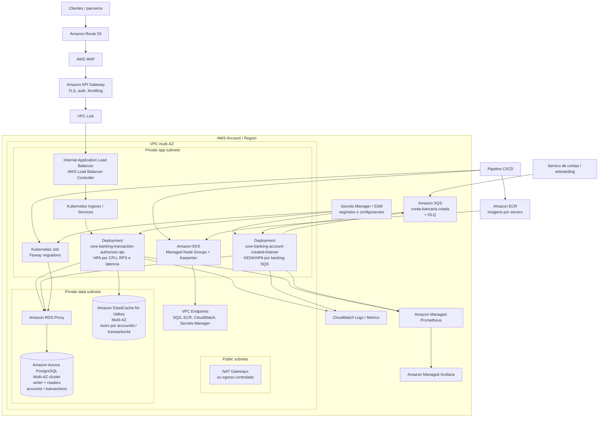

# Deploy em cloud AWS com EKS

Topologia proposta para executar o core banking em produção na AWS usando
**Amazon EKS** como plataforma de containers.

## Diagrama

Arquivo editável para apresentação: [cloud-deployment.drawio](cloud-deployment.drawio).

Para apresentar e alterar durante a conversa:

- **draw.io / diagrams.net:** abra `docs/cloud-deployment.drawio` em
  `File > Open from > Device`. As caixas e conectores ficam editáveis.
- **Miro:** importe uma exportação do draw.io em SVG/PDF/PNG para apresentação
  visual. Para edição plena dentro do Miro, recrie a partir dos elementos nativos
  do Miro ou use o Mermaid como base, pois importações visuais podem virar imagem
  ou grupos pouco editáveis.

> As legendas do diagrama estão sem acento de propósito, para máxima
> compatibilidade de renderização do Mermaid em diferentes visualizadores.

## Leitura da arquitetura

- **Borda:** o Route 53 direciona o domínio para o API Gateway. O AWS WAF protege
  contra tráfego malicioso, enquanto o API Gateway concentra TLS, autenticação,
  autorização e throttling técnico. O tráfego entra na VPC por **VPC Link**.
- **Entrada no cluster:** o **AWS Load Balancer Controller** provisiona um
  Application Load Balancer interno para rotear chamadas ao Ingress da API. O
  listener SQS não é exposto externamente.
- **Compute:** os serviços rodam em **EKS Managed Node Groups**, com **Karpenter**
  para escalar a capacidade de nós conforme a demanda. Java/Spring em EC2
  gerenciado tende a ser mais previsível para alta volumetria do que iniciar tudo
  em compute sob demanda por requisição.
- **Serviço síncrono:** `core-banking-transaction-authorizer-api` escala por HPA
  usando CPU, latência, RPS e métricas de erro. Usa o Valkey para locks
  temporários e o Aurora PostgreSQL como fonte da verdade transacional.
- **Serviço assíncrono:** `core-banking-account-created-listener` consome a fila
  `conta-bancaria-criada` e escala por backlog do SQS usando KEDA ou métricas
  customizadas (`ApproximateNumberOfMessagesVisible`).
- **Persistência:** o Amazon Aurora PostgreSQL-Compatible Multi-AZ guarda
  `accounts` e `transactions`. O cluster possui instância writer e readers para
  crescimento de leitura. O RDS Proxy reduz o risco de exaustão de conexões
  quando o número de pods cresce.
- **Mensageria:** o Amazon SQS usa DLQ e redrive policy para mensagens venenosas.
  O processamento segue at-least-once com idempotência por `accountId`.
- **Coordenação:** o Amazon ElastiCache for Valkey é usado apenas para locks
  distribuídos de curta duração. A aplicação continua usando o cliente/protocolo
  Redis compatível; saldo e ledger continuam no Aurora PostgreSQL.
- **Segredos e identidade:** o Secrets Manager/SSM guardam credenciais e
  parâmetros. Os pods acessam a AWS usando **IRSA** (IAM Roles for Service
  Accounts), sem chaves estáticas.
- **Observabilidade:** os logs vão para o CloudWatch; as métricas
  Actuator/Prometheus são coletadas no Amazon Managed Prometheus e visualizadas
  no Grafana. Traces podem ser enviados via OpenTelemetry para o X-Ray ou backend
  equivalente.

## Alta disponibilidade e resiliência

- EKS, Aurora, Valkey e pods distribuídos em pelo menos **3 AZs**.
- Deployments com `readinessProbe`, `livenessProbe`, `PodDisruptionBudget`,
  requests/limits e anti-affinity entre réplicas críticas.
- Aurora PostgreSQL Multi-AZ com backups, PITR, failover automático e janela de
  manutenção controlada.
- Valkey Multi-AZ com failover automático.
- SQS com DLQ, visibility timeout maior que o tempo máximo de processamento e
  redrive controlado.
- VPC Endpoints reduzem a dependência de NAT para acessar SQS, ECR, CloudWatch e
  Secrets Manager.

## Deploy e migrations

As imagens são publicadas no **ECR** com tag imutável baseada no git SHA. O
pipeline executa testes, scans, build das imagens e depois roda um **Kubernetes
Job de Flyway** antes do rollout dos serviços.

O rollout recomendado é canary/blue-green:

- API: canary progressivo por porcentagem de tráfego, observando erro, latência
  p99 e métricas de negócio.
- Listener: rolling update controlado, seguro por causa da idempotência e da
  entrega at-least-once do SQS.
- Banco: estratégia expand/contract para manter as migrations retrocompatíveis
  com versões antigas e novas da aplicação.
