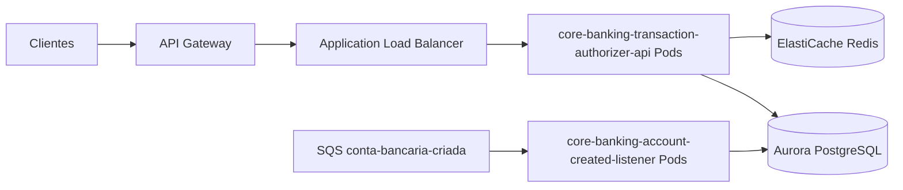

# Deploy em cloud (referência AWS)

Topologia de referência para rodar os dois serviços em cloud pública AWS.

```
                   ┌───────────────┐
       clientes ──▶│ Amazon Route53│
                   └───────┬───────┘
                           ▼
                  ┌──────────────────┐
                  │  API Gateway /   │  TLS, throttling, autN/Z (WAF)
                  │  Application LB   │
                  └────────┬─────────┘
                           ▼
        ┌──────────────────────────────────────┐
        │  EKS / ECS Fargate (subnets privadas) │
        │                                       │
        │  core-banking-transaction-             │  HPA por RPS/latência
        │  authorizer-api                        │
        │   (Deployment, N réplicas)            │
        │                                       │
        │  core-banking-account-created-listener │  escala por profundidade da fila
        │   (Deployment, M réplicas)            │
        └───────┬───────────────────┬───────────┘
                │                   │
        ┌───────▼────────┐   ┌──────▼─────────┐
        │  Amazon RDS    │   │   Amazon SQS   │  conta-bancaria-criada
        │  PostgreSQL    │   │   + DLQ        │
        │  (Multi-AZ)    │   └────────────────┘
        └────────────────┘
```

## Diagrama (Mermaid)



## Componentes

- **Borda:** Route 53 + API Gateway (ou ALB) com WAF e terminação TLS. Throttling
  técnico contra abuso pode existir na borda, mas não substitui a serialização
  por conta no fluxo de autorização. O listener não é exposto à internet.
- **Compute:** containers em **EKS** (ou **ECS Fargate**). Cada serviço é um
  Deployment/Service independente com seu próprio autoscaling:
  - API → Horizontal Pod Autoscaler por CPU + RPS/latência.
  - Listener → escala por **`ApproximateNumberOfMessagesVisible` do SQS**
    (KEDA / app autoscaling); muitas vezes 0..N conforme o backlog.
- **Banco:** **Amazon RDS for PostgreSQL**, Multi-AZ, com read replicas se a
  carga de leitura crescer. Apenas subnets privadas; acesso via security
  groups/IAM.
- **Mensageria:** **Amazon SQS** com **dead-letter queue** e redrive policy para
  poison messages; visibility timeout ajustado ao tempo de processamento.
- **Coordenação/cache:** **Amazon ElastiCache for Redis** — camada auxiliar da
  API para lock distribuído (`transactionId`/`accountId`). Não armazena saldo
  nem é fonte da verdade (ver
  [ADR 0007](adr/0007-redis-distributed-locks.md)).
- **Segredos/config:** AWS Secrets Manager / SSM Parameter Store, injetados como
  variáveis de ambiente (12-factor). IAM roles for service accounts (IRSA) — sem
  chaves estáticas.
- **Observabilidade:** scrape Prometheus de `/actuator/prometheus` (ou agente
  CloudWatch), logs centralizados (CloudWatch/OpenSearch), traces (OTel/X-Ray).
- **Tipo de compute:** começar com Fargate/nós pequenos; a API é limitada por
  CPU/latência e o listener por I/O — dimensionar de forma independente.

## Migrations de schema

O Flyway roda como um **job/step dedicado no pipeline antes do deploy** (não no
startup da aplicação em produção), de forma que os rollouts (blue/green, canary)
fiquem desacoplados das mudanças de schema. Ver [pipeline.md](pipeline.md).
