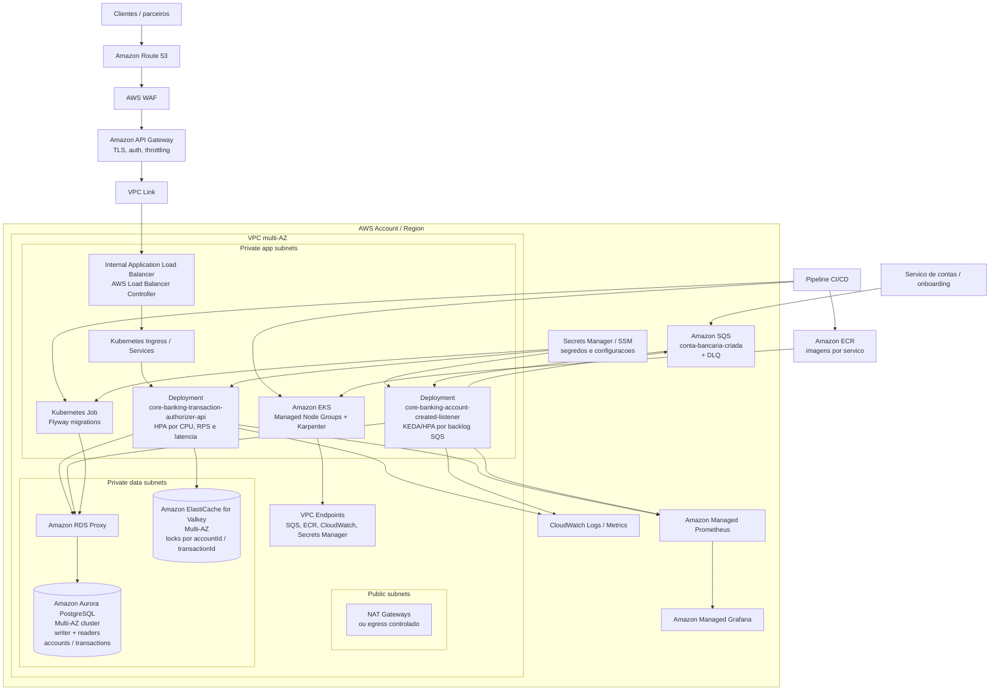

# Deploy em cloud AWS com EKS

Topologia proposta para executar o core banking em produção na AWS usando
**Amazon EKS** como plataforma de containers.

## Diagrama

Arquivo editavel para apresentacao: [cloud-deployment.drawio](cloud-deployment.drawio).

Para apresentar e alterar durante a conversa:

- **draw.io / diagrams.net:** abra `docs/cloud-deployment.drawio` em
  `File > Open from > Device`. As caixas e conectores ficam editaveis.
- **Miro:** importe uma exportacao do draw.io em SVG/PDF/PNG para apresentacao
  visual. Para edicao plena dentro do Miro, recrie a partir dos elementos nativos
  do Miro ou use o Mermaid como base, pois importacoes visuais podem virar imagem
  ou grupos pouco editaveis.

## Leitura da arquitetura

- **Borda:** Route 53 direciona o dominio para o API Gateway. AWS WAF protege
  contra trafego malicioso, enquanto o API Gateway concentra TLS, autenticacao,
  autorizacao e throttling tecnico. O trafego entra na VPC por **VPC Link**.
- **Entrada no cluster:** o **AWS Load Balancer Controller** provisiona um
  Application Load Balancer interno para rotear chamadas ao Ingress da API. O
  listener SQS nao e exposto externamente.
- **Compute:** os servicos rodam em **EKS Managed Node Groups**, com **Karpenter**
  para escalar capacidade de nos conforme demanda. Java/Spring em EC2 gerenciado
  tende a ser mais previsivel para alta volumetria do que iniciar tudo em
  compute sob demanda por requisicao.
- **Servico sincrono:** `core-banking-transaction-authorizer-api` escala por HPA
  usando CPU, latencia, RPS e metricas de erro. Usa Valkey para locks
  temporarios e Aurora PostgreSQL como fonte da verdade transacional.
- **Servico assincrono:** `core-banking-account-created-listener` consome a fila
  `conta-bancaria-criada` e escala por backlog do SQS usando KEDA ou metricas
  customizadas (`ApproximateNumberOfMessagesVisible`).
- **Persistencia:** Amazon Aurora PostgreSQL-Compatible Multi-AZ guarda
  `accounts` e `transactions`. O cluster possui instancia writer e readers para
  crescimento de leitura. O RDS Proxy reduz risco de exaustao de conexoes quando
  o numero de pods cresce.
- **Mensageria:** Amazon SQS usa DLQ e redrive policy para mensagens venenosas.
  O processamento segue at-least-once com idempotencia por `accountId`.
- **Coordenacao:** Amazon ElastiCache for Valkey e usado apenas para locks
  distribuidos de curta duracao. A aplicacao continua usando cliente/protocolo
  Redis compativel; saldo e ledger continuam no Aurora PostgreSQL.
- **Segredos e identidade:** Secrets Manager/SSM guardam credenciais e parametros.
  Os pods acessam AWS usando **IRSA** (IAM Roles for Service Accounts), sem
  chaves estaticas.
- **Observabilidade:** logs vao para CloudWatch; metricas Actuator/Prometheus sao
  coletadas no Amazon Managed Prometheus e visualizadas no Grafana. Traces podem
  ser enviados via OpenTelemetry para X-Ray ou backend equivalente.

## Alta disponibilidade e resiliencia

- EKS, Aurora, Valkey e pods distribuidos em pelo menos **3 AZs**.
- Deployments com `readinessProbe`, `livenessProbe`, `PodDisruptionBudget`,
  requests/limits e anti-affinity entre replicas criticas.
- Aurora PostgreSQL Multi-AZ com backups, PITR, failover automatico e janela de
  manutencao controlada.
- Valkey Multi-AZ com failover automatico.
- SQS com DLQ, visibility timeout maior que o tempo maximo de processamento e
  redrive controlado.
- VPC Endpoints reduzem dependencia de NAT para acessar SQS, ECR, CloudWatch e
  Secrets Manager.

## Deploy e migrations

As imagens sao publicadas no **ECR** com tag imutavel baseada no git SHA. O
pipeline executa testes, scans, build das imagens e depois roda um **Kubernetes
Job de Flyway** antes do rollout dos servicos.

O rollout recomendado e canary/blue-green:

- API: canary progressivo por porcentagem de trafego, observando erro, latencia
  p99 e metricas de negocio.
- Listener: rolling update controlado, seguro por causa de idempotencia e
  entrega at-least-once do SQS.
- Banco: estrategia expand/contract para manter migrations retrocompativeis com
  versoes antigas e novas da aplicacao.
